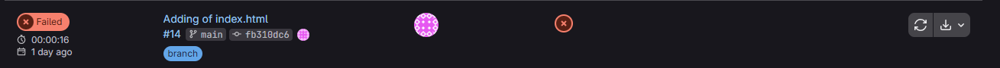
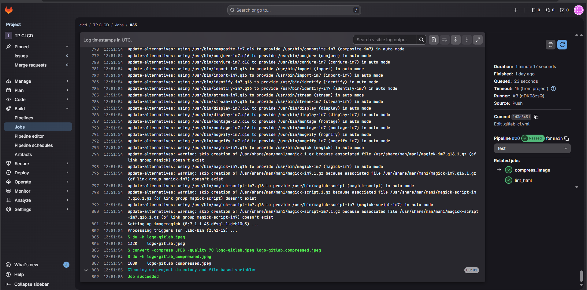
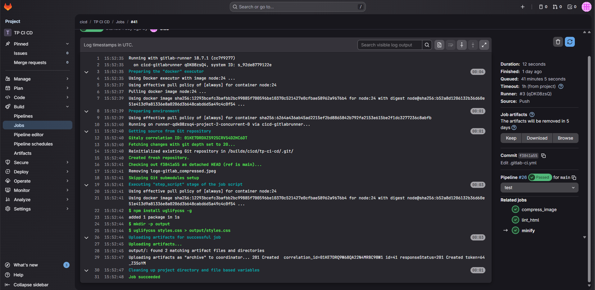
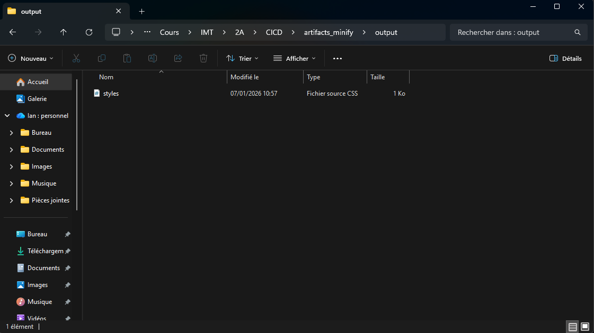
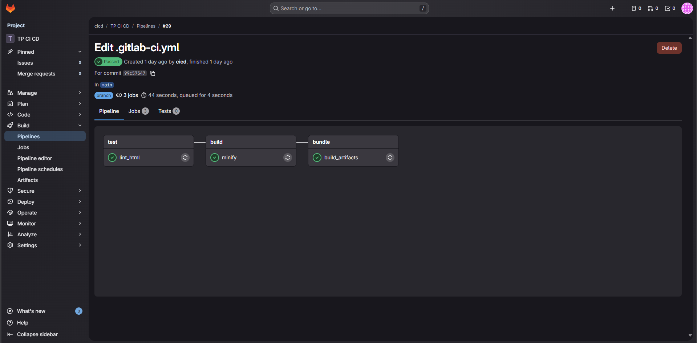
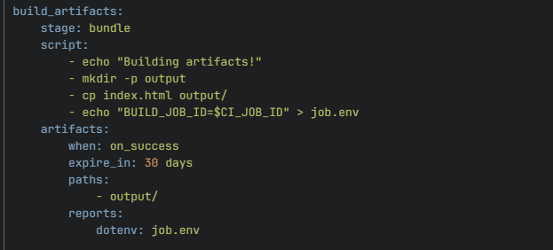

# Rapport du fiche de TP CI/CD

| Date | Matière | Etudiants |
|-|-|-|
| 07/01/2026 | INTÉ DEPLOIEMENT CONTINUS | - Mesrop AGHUMYAN<br>- Ian BERTIN |

# Sommaire

1. [Notes préalables](#1-notes-préalables)
    - 1.1 [Pré-requis](#11-pré-requis)
    - 1.2 [Comptes](#12-comptes)
2. [Mise en place de la VM GitLab](#2-mise-en-place-de-la-vm-gitlab)
    - 2.1 [VirtualBox](#21-virtualbox)
    - 2.2 [Sur le système Debian cicd-gitlab](#22-sur-le-système-debian-cicd-gitlab)
        - 2.2.1 [Modifications de base](#221-modifications-de-base)
    - 2.3 [Créer un dépôt](#23-créer-un-dépôt)
3. [Mise en place de la VM GitLab Runner](#3-mise-en-place-de-la-vm-gitlab-runner)
    - 3.1 [VirtualBox](#31-virtualbox)
    - 3.2 [Sur le système Debian cicd-gitlabrunner](#32-sur-le-système-debian-cicd-gitlabrunner)
        - 3.2.1 [Modifications de base](#321-modifications-de-base)
    - 3.3 [Éditer la configuration de GitLab Runner](#33-éditer-la-configuration-de-gitlab-runner)
4. [Premières contributions dans notre dépôt](#4-premières-contributions-dans-notre-dépôt)
    - 4.1 [.gitlab-ci.yml](#41-gitlab-ciyml)
    - 4.2 [index.html](#42-indexhtml)
    - 4.3 [Pipelines](#43-pipelines)
5. [Génération de livrables](#5-génération-de-livrables)
    - 5.1 [Ajout et modifications d’éléments](#51-ajout-et-modifications-déléments)
        - 5.1.1 [index.html](#511-indexhtml)
        - 5.1.2 [style.css](#512-stylecss)
        - 5.1.3 [logo-gitlab.jpeg](#513-logo-gitlabjpeg)
    - 5.2 [Mise en place de la compression d'images](#52-mise-en-place-de-la-compression-dimages)
    - 5.3 [Mise en place de la minification CSS](#53-mise-en-place-de-la-minification-css)
    - 5.4 [Export en Artifacts](#54-export-en-artifacts)
6. [Mise en place de Stages](#6-mise-en-place-de-stages)
7. [Déploiement d'un livrable](#7-déploiement-dun-livrable)
    - 7.1 [Créer un Artifact regroupant tous les fichiers](#71-créer-un-artifact-regroupant-tous-les-fichiers)
    - 7.2 [Ajout de la clé privée SSH dans GitLab](#72-ajout-de-la-clé-privée-ssh-dans-gitlab)
    - 7.3 [Mise en place de la VM de déploiement](#73-mise-en-place-de-la-vm-de-déploiement)
    - 7.4 [Ajouter un job de déploiement](#74-ajouter-un-job-de-déploiement)
8. [Mise en place des différentes branches](#8-mise-en-place-des-différentes-branches)
9. [Exfiltration du .gitlab-ci.yml](#9-exfiltration-du-gitlab-ciyml)
10. [RenovateBot](#10-renovatebot)
11. [Releases](#11-releases)

# 1. Notes préalables

## 1.1 Pré-requis

Pour la réalisation de ce TP, nous avons préparé un environnement de virtualisation sous VirtualBox disposant de :

- **30 Go d'espace disque** et **16 Go de RAM**.

- L'accès aux identifiants administrateurs (root) et utilisateurs (cicd).

## 1.2 Comptes

Les accès ont été centralisés pour la configuration des machines Debian et de l'interface GitLab :

| Compte | Identifiant | Mot de passe |
|-|-|-|
| Systèmes Debian | root | mineales |
| Compte administrateur GitLab | root | mineales |
| Compte utilisateur normal GitLab | cicd | mineales |

# 2. Mise en place de la VM GitLab

## 2.1 VirtualBox

Nous avons importé l'appareil virtuel **cicd-gitlab.ova**. Cette machine servira de serveur central pour l'hébergement du code et l'orchestration des pipelines.

## 2.2 Sur le système Debian cicd-gitlab

### 2.2.1 Modifications de base

Après démarrage, nous avons récupéré l'adresse IP via la commande `ip a`.

Adresse IP identifiée : **192.168.56.10**.

Afin d'accéder au serveur via un nom de domaine, nous avons modifié le fichier **hosts** de notre machine hôte :

**Windows** : `C:\Windows\system32\drivers\etc\hosts`

**Ligne ajoutée** : `192.168.56.10 gitlab.example.com`

## 2.3 Créer un dépôt

Connectés avec l'utilisateur **cicd**, nous avons créé un projet vide :

**Project name** : TP CI CD

**Namespace** : cicd

# 3. Mise en place de la VM GitLab Runner

## 3.1 VirtualBox

Importation de la machine **cicd-gitlabrunner.ova**. Cette VM agira comme l'exécuteur des tâches définies dans nos pipelines.

## 3.2 Sur le système Debian cicd-gitlabrunner

### 3.2.1 Modifications de base

Comme pour la VM précédente, nous avons configuré le fichier `/etc/hosts` de la VM Runner pour qu'elle puisse résoudre l'adresse **gitlab.example.com**.

## 3.3 Éditer la configuration de GitLab Runner

Pour que les conteneurs Docker lancés par le Runner puissent communiquer avec le serveur GitLab, nous avons édité `/etc/gitlab-runner/config.toml`.

**Modification** : Ajout de `extra_hosts = ["gitlab.example.com:192.168.56.10"]` dans la section `[runners.docker]`.

**Redémarrage** : `systemctl restart gitlab-runner`.

**Vérification** : Dans l'interface GitLab **(Admin > Runners)**, le Runner apparaît avec une pastille verte.


# 4. Premières contributions dans notre dépôt

## 4.1 .gitlab-ci.yml

Nous avons initialisé la CI avec un job de **linting** pour valider la syntaxe HTML :

```yaml
lint_html:
  script:
    - apt update
    - apt install -y tidy
    - tidy -q index.html > /dev/null
```

## 4.2 index.html

Création d'un fichier HTML incluant volontairement une erreur (balise `<meta` non fermée) pour tester la réaction du pipeline.

## 4.3 Pipelines

En consultant l'onglet **Build > Pipelines**, nous avons observé l'exécution du job. Le premier pipeline échoue comme prévu à cause de l'erreur de syntaxe, validant ainsi l'utilité du job de test.




# 5. Génération de livrables

## 5.1 Ajout et modifications d’éléments

### 5.1.1 index.html

Correction de la balise meta et ajout d'une image : ``.

### 5.1.2 style.css

Ajout d'une feuille de style simple (h1 en rouge).

### 5.1.3 logo-gitlab.jpeg

Téléversement de l'image source dans le dépôt.


## 5.2 Mise en place de la compression d'images

Ajout du job `compress_pictures` utilisant **ImageMagick** pour réduire la qualité des images à 70% et les placer dans un dossier **output/**.




## 5.3 Mise en place de la minification CSS
Ajout du job minify_css utilisant une image Docker node:24 et l'outil uglifycss pour compresser le fichier CSS.



## 5.4 Export en Artifacts

Nous avons configuré les jobs pour conserver le dossier **output/** pendant 7 jours.

**Résultat** : Les fichiers minifiés et compressés sont téléchargeables directement depuis l'interface GitLab.



# 6. Mise en place de Stages

Nous avons structuré le pipeline en deux étapes distinctes :

**Stage test** : Exécution de `lint_html`.

**Stage build** : Exécution de `minify_css`.

> Note : On a pas lancer la compression d'images dans le build car le process était trop lent.

Cela garantit que les fichiers ne sont générés que si les tests de syntaxe réussissent.


# 7. Déploiement d'un livrable

## 7.1 Créer un Artifact regroupant tous les fichiers

Création du job `build_artifacts` (Stage bundle) pour regrouper l'**index.html** et le contenu du dossier **output/** */.



## 7.2 Ajout de la clé privée SSH dans GitLab

Pour permettre le déploiement automatique, nous avons ajouté la clé privée fournie dans les variables CI/CD sous le nom `SSH_PRIVATE_KEY` (Type: Variable, non protégée).


## 7.3 Mise en place de la VM de déploiement

Importation et démarrage de la VM **cicd-deploy.ova** (IP : **192.168.56.30**).

## 7.4 Ajouter un job de déploiement

Mise en place du job deploy :

Installation du client SSH.

Configuration de la clé privée dans `~/.ssh/id_rsa`.

Sécurisation : Ajout de l'empreinte du serveur dans **known_hosts** via une variable pour éviter l'usage de `StrictHostKeyChecking=accept-new`.

Action : Déploiement des fichiers dans `/var/www/html/` via scp.


Pipeline qui passe avec succès :


Affichage de la page de test :


# 8. Mise en place des différentes branches

Nous avons instauré une gestion multi-environnements :

**Branche dev** : Déploiement automatique vers `/var/www/html/dev`.


**Branche main** : Déploiement vers `/var/www/html/main` avec déclenchement manuel (`when: manual`).


**Dynamisation** : Utilisation de sed pour remplacer "Infos" par `$CI_COMMIT_AUTHOR` et `$CI_COMMIT_SHORT_SHA`.

**Conditionnel** : La minification CSS est réservée à la branche main via le mot-clé `only: [main]`.

# 9. Exfiltration du .gitlab-ci.yml

Pour centraliser la maintenance, nous avons déplacé la configuration CI/CD dans un dépôt externe Gitlab CI YML.


Dans le projet principal, nous avons pointé vers ce fichier distant : `.gitlab-ci.yml@cicd/gitlab-ci-yml`.


Le pipeline reste fonctionnel même sans fichier YAML local au projet web.

# 10. RenovateBot

Mise en place d'un outil de veille automatique sur les dépendances :

- Création du projet RenovateBot incluant le template officiel.


- Configuration des settings CI/CD.


- Configuration du token d'accès.


- Configuration d'un Pipeline Schedule quotidien.


**Test** : En forçant une image ancienne (**debian:12**), RenovateBot a automatiquement ouvert une Merge Request pour proposer la mise à jour vers **debian:13**.


# 11. Releases

Modernisation et finalisation du cycle de vie :

- **Rules** : Remplacement de tous les only par des rules.


- **Artifact Report** : Utilisation d'un fichier .env pour transmettre le $CI_JOB_ID.



- **Job create:release** : Utilisation de **release-cli** pour créer une version officielle GitLab lors de la création d'un Tag.


**Résultat final** : Lors du push d'un tag, GitLab génère une Release contenant un lien direct vers l'archive zip des artifacts de ce build précis.


Chaine complète du pipeline :


